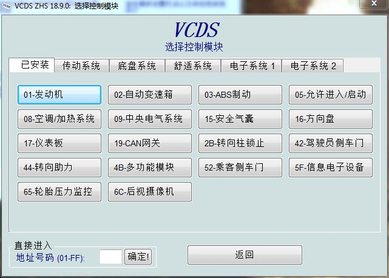
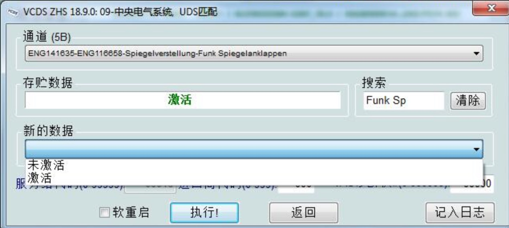
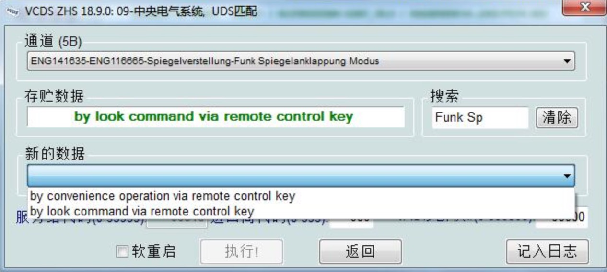
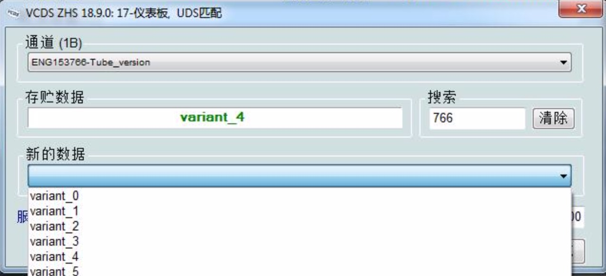

### 高尔夫7 / 7.5 / GTI

##### 1.电动后视镜折叠
选择`09-中央电气系统`  -> 访问权限 -> `31347` -> 执行 -> 功能匹配    
搜索通道 -> `Funk Spiegelanklappen` -> 值选择为 `激活` -> 执行  
搜索通道 -> `Funk Spiegelanklappung Modus` -> 值选择为 `by look command viaremote control key` -> 执行  
    `by look command viaremote control key` 锁车立即自动折叠  
    `by convenienceoperation via remote control key` 按锁车键2秒自动折叠  
选择`09-中央电气系统` -> 基本设置 -> 选择所有匹配值的复位 -> 确定

##### 2.转向3变5  
选择`09-中央电气系统`  -> 访问权限 -> `31347` -> 执行 -> 功能匹配  
搜索通道 -> `Komfortblinken Blinkerzyklen`-> 值改为 `5` -> 执行, 可以输入1-5内数字,对应同闪烁次数  

##### 10.液晶仪表改表底
选择`17-仪表版` -> 允许进入 -> `31347` -> 匹配  
搜索通道 -> `ENG153766_Tube_Version` 值选择为 `variant_4`  
    `variant_1`至`variant_4`的值分别对应`240`,`260`,`280`,`320`  

##### 11.永久关闭自动启停  
选择`19-CAN网关` -> 功能匹配
搜索通道 -> `IDE08348` -> 值改为`12` -> 执行 

### 故障清除

##### 1.清除二代胎压仪表故障灯
进入03 -> 允许进入 -> `40468` -> 基本设定 –> 复位至轮胎压力监控器的工厂设置 断电/打火即可
